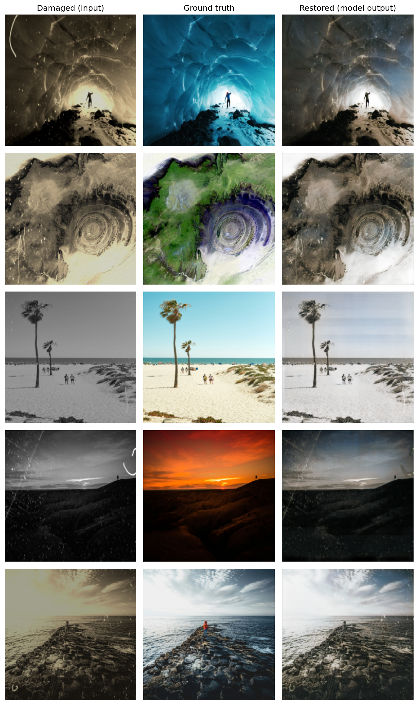

# Image Restoration with U-Net

A supervised deep learning pipeline that restores damaged old photographs — removing scratches, noise, and fading — using a U-Net trained on paired damaged/clean images.




## Results

| Metric | Mean | Std Dev | Required Minimum |
|---|---|---|---|
| PSNR (dB) | 23.27 | 3.84 | ≥ 20 dB |
| SSIM | 0.864 | 0.096 | ≥ 0.65 |

The model reliably removes structural damage (scratches, dust, fine noise) and preserves scene structure well. Its main weakness is under-restoring color saturation on heavily faded inputs — see the [full report](CV_Final_Project_Report.pdf) for a detailed analysis.

## Overview

- **Task:** given a damaged photo, output a restored version close to the original
- **Dataset:** [`joshuachin/openphoto-restore-dataset`](https://huggingface.co/datasets/joshuachin/openphoto-restore-dataset) — paired damaged/clean images
- **Model:** U-Net (encoder-decoder with skip connections), ~7.77M parameters
- **Loss:** L1 (Mean Absolute Error)
- **Training:** 50 epochs, Adam optimizer, lr=1e-4, batch size 16, on a Colab T4 GPU

## Why U-Net?

A plain autoencoder's bottleneck discards fine spatial detail, producing blurry restorations. A VAE is built for generating novel samples, not faithfully reconstructing one specific target. A GAN can sharpen texture further but is unstable and slow to tune. U-Net's skip connections let the decoder reuse high-resolution detail from the encoder directly, giving sharp, pixel-accurate output while training in a simple, stable, fully supervised way — a good match for a task with a specific ground truth to hit.

Full architecture comparison and reasoning in [the report](CV_Final_Project_Report.pdf).

## Setup

```bash
git clone https://github.com/mosipamo/Image-Restoration.git
cd Image-Restoration
pip install -r requirements.txt
```

Recommended: run on a GPU (Google Colab's free T4 tier is enough — training takes well under an hour for 50 epochs at this model size).

## Usage
You should just run main.ipynb cells in order. 

If you're running on Colab, mount Google Drive and point the checkpoint/output paths there so results survive a runtime disconnect.

## Configuration

Key hyperparameters:

| Parameter | Value |
|---|---|
| Image size | 256×256 |
| Batch size | 16 |
| Learning rate | 1e-4 |
| Epochs | 50 |
| Loss | L1 |
| Optimizer | Adam |

## Limitations & future work

- Under-restores color saturation on heavily faded inputs (the model's main weakness — see report §8–9)
- Trained only on one dataset/domain; generalization to other damage types (tears, folds, handwriting) is untested
- Purely reconstructive — can't hallucinate detail that's fully absent from the input

Planned improvements: a perceptual (VGG-based) loss term, a lightweight adversarial component to push color vividness, higher-resolution training, and data augmentation. Details in the [report](CV_Final_Project_Report.pdf).

## Report

The full project report — preprocessing, architecture comparison, training configuration, loss curve analysis, quantitative results, visual samples, and limitations — is in [`CV_Final_Project_Report.pdf`](CV_Final_Project_Report.pdf)